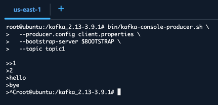

Recently, we have been working on a project that requires connecting from a pod running in Elastic Kubernetes Service (EKS) to a Managed Streaming for Apache Kafka (MSK) cluster. I've done this before, but I've never set up the whole thing from scratch. I thought it would be a good idea to document the steps I took to get everything working. This includes the following:

- Setting up the MSK cluster
- Setting up the EKS cluster
- Adjusting the security groups
- Installing Kafka tools on the EKS pod
- Enabling identity providers for the EKS cluster
- Creating an IAM role for the EKS service account
- Creating a Kubernetes service account
- Adjusting the trust relationship for the IAM role
- Creating a Kafka topic, producing messages, and consuming messages
- Cleaning up the resources after testing to save costs

That seems like a lot, but I'll keep the guide full of screenshots and explanations to make it easy to follow along. Let's get started!

> I intentionally refrained from explaining the "behind the scenes" of how this machinery works, to keep the guide focused on the practical steps. Google `Understanding AWS IRSA` to find resources that explain the concepts in detail, if you're interested in the underlying mechanisms.

# Prerequisites
- **An AWS account:** You'll need an AWS account to create the resources. This will cost you a bit, but you can use the free tier for some services. Without it, it cost me around 1 USD (estimated) for the whole setup. YMMV.
- You'll need some knowledge of Kubernetes and Kafka, as well as a general understanding of AWS services.
- I'll use AWS Web Console (including CloudShell) for all the steps.

# Setting up the MSK cluster
1. **Open the AWS Management Console** and navigate to the **MSK service**.
2. Click on **Create cluster**.
3. Choose the **Quick create** option.
4. Name your cluster `demo-msk-cluster`.
5. Set cluster type to **Serverless**. (So you pay as you go, and it scales automatically.)
6. Leave all the other settings as default.
7. Click on **Create cluster**.

It will take a few minutes to create the cluster. Once it's created, you can see it in the list of clusters, with a status of **Active**.


Click on `View client information` to see the connection details. You'll need this information later when connecting from the EKS pod.


As you can see above, the `Authentication type` is IAM, and the Bootstrap server endpoint is as follows: 
```text
boot-6nbanb1s.c3.kafka-serverless.us-east-1.amazonaws.com:9098
```

Your cluster will have a different endpoint, so make sure to copy it down and use it in the next steps.

# Setting up the EKS cluster
1. **Open the AWS Management Console** and navigate to the **Elastic Kubernetes Service**.
2. Go to the **Clusters** section and click on **Create cluster**.
3. Select `Quick configuration (with EKS Auto Mode)`
4. Name your cluster `dev`, leave the Kubernetes version, VPC, and subnets as default.
5. Click on the `Create recommended role` button for `Cluster IAM role` and `Node IAM role`, as denoted below:
6. 


Follow the default settings for `Create recommended role`
  * **Cluster IAM role**
    * **Trusted entity type:** AWS service
    * **Use case:** EKS 👉 EKS - Auto Cluster
    * Add the default permissions, click next, and then create the role.
  * **Node IAM role**
      * **Trusted entity type:** AWS service
      * **Use case:** EKS 👉 EKS - Auto Node
      * Add the default permissions, click next, and then create the role.
  Going back to the EKS cluster creation page, refresh the role list, and then select the appropriate roles for the cluster and node IAM roles.
  

Click on **Create** to create the EKS cluster. It will take a few minutes to create the cluster. Once it's created, you can see it in the list of clusters, with a status of **Active**. (In my experience, it took a bit more to create an EKS cluster than an MSK cluster, so be patient.)

# Adjusting the security groups

Let's create our first pod in the EKS cluster to connect to the MSK cluster. Open CloudShell in the AWS Management Console, and run the following command to configure kubectl to use the EKS cluster (use the region where you created the EKS cluster):

```bash
aws eks update-kubeconfig --region us-east-1 --name dev
```

To test, let's list the nodes in the EKS cluster:

```bash
kubectl get nodes
```

It should return a single node, as shown below:


Let's create an Ubuntu pod. Here's the pod manifest that we'll use to create the pod:

```yaml
apiVersion: v1
kind: Pod
metadata:
  name: ubuntu
spec:
  containers:
    - name: ubuntu
      image: ubuntu:24.04
      command: ["/bin/bash", "-c", "sleep infinity"]  # keep the container running
```

In CloudShell, save the above manifest to a file named `ubuntu.yaml`, and then run the following command to create the pod:

```bash
kubectl apply -f ubuntu.yaml
```

If you immediately run `kubectl describe pods`, you'll see a `FailedScheduling`, with error message:
```text
0/1 nodes are available: 1 node(s) had untolerated taint {CriticalAddonsOnly: }
```
This is because the single node in the EKS cluster has a taint that prevents pods from being scheduled on it unless they tolerate the taint. Since this is a serverless & elastic cluster, it automatically adds a node after some time, and schedules the pod on it.


We'll now get a shell into the pod to start our work. Run the following command to get a shell into the pod:

```bash
kubectl exec -it ubuntu -- bash
```

Your prompt should change to something like `root@ubuntu:/#`. Let's update the package list and install some necessary network tools:

```bash
apt update && apt install -y net-tools netcat-traditional iputils-ping
```

Now let's check if the pod can resolve the MSK cluster's bootstrap server endpoint name, and access its port. Run the following command to check if the pod can resolve the endpoint (replace the endpoint with your MSK cluster's bootstrap server endpoint):

```bash
ping boot-6nbanb1s.c3.kafka-serverless.us-east-1.amazonaws.com
```

Yes, it could resolve the endpoint to `172.31.37.226` (in my case), but there was 100% packet loss. To check the port, run the following command:

```bash
nc -zv boot-6nbanb1s.c3.kafka-serverless.us-east-1.amazonaws.com 9098
```

No, the port is not accessible! We need to adjust the security groups to allow access from the EKS cluster to the MSK cluster. Let's find the IP of the pod first, so we can add it to the security group of the MSK cluster.

```bash
ifconfig
```

This shows the IP address of the pod, which in my case is `172.31.30.160`. But I want the IP address of any pod that will be created in the EKS cluster, so I need to check the IP address of the subnets in the VPCs where the EKS cluster is created. There are actually several subnets, and it's generic enough to use `172.31.0.0/16` as the CIDR block for the VPC.

Go to the MSK cluster `demo-msk-cluster` 👉 Properties, and scroll down to the **Security groups applied** section. Click on the security group link to open it in a new tab.


Click on **Edit inbound rules**, and then click on **Add rule**. Select `All Traffic` as the type, and `172.31.0.0/16` as the custom source. Click on **Save rules** to save the changes.


Now, if you try Netcat again (inside the pod), it should work:
```bash
nc -zv boot-6nbanb1s.c3.kafka-serverless.us-east-1.amazonaws.com 9098
```

```text
vpce-07ab4e3e8f8e8a7d3-4nhymqra.vpce-svc-015711cabcd5af80a.us-east-1.vpce.amazonaws.com [172.31.26.34] 9098 (?) open
```

# Installing Kafka tools on the EKS pod
OK, so we now have the basic network connectivity between the EKS pod and the MSK cluster. But to send requests to Kafka, we need to authenticate the requests. Since our MSK cluster is configured to use IAM authentication, it won't work out of the box.

Let's try connecting to MSK without any authentication first, to see what happens. The following steps will be used to set up the Kafka client in the pod. First, we need to install OpenJDK and wget:

```bash
apt update && apt install -y openjdk-21-jre-headless wget
```

Then, download and install Kafka tools:

```bash
wget https://dlcdn.apache.org/kafka/3.9.1/kafka_2.13-3.9.1.tgz
tar xvf kafka_2.13-3.9.1.tgz
cd kafka_2.13-3.9.1

export BOOTSTRAP=boot-6nbanb1s.c3.kafka-serverless.us-east-1.amazonaws.com:9098
```

Now, let's list the topics in the MSK cluster using the `kafka-topics.sh` script:

```bash
bin/kafka-topics.sh \
  --bootstrap-server $BOOTSTRAP \
  --list
```

It errs, as expected:

```text
Error while executing topic command : The AdminClient thread has exited. Call: listTopics
[2025-06-25 21:08:47,814] ERROR org.apache.kafka.common.errors.TimeoutException: The AdminClient thread has exited. Call: listTopics
 (org.apache.kafka.tools.TopicCommand)
[2025-06-25 21:08:47,822] ERROR Uncaught exception in thread 'kafka-admin-client-thread | adminclient-1': (org.apache.kafka.common.utils.KafkaThread)
java.lang.OutOfMemoryError: Java heap space
        at java.base/java.nio.HeapByteBuffer.<init>(HeapByteBuffer.java:71)
        at java.base/java.nio.ByteBuffer.allocate(ByteBuffer.java:391)
        at org.apache.kafka.common.memory.MemoryPool$1.tryAllocate(MemoryPool.java:30)
        at org.apache.kafka.common.network.NetworkReceive.readFrom(NetworkReceive.java:103)
        at org.apache.kafka.common.network.KafkaChannel.receive(KafkaChannel.java:462)
        at org.apache.kafka.common.network.KafkaChannel.read(KafkaChannel.java:412)
        at org.apache.kafka.common.network.Selector.attemptRead(Selector.java:694)
        at org.apache.kafka.common.network.Selector.pollSelectionKeys(Selector.java:596)
        at org.apache.kafka.common.network.Selector.poll(Selector.java:501)
        at org.apache.kafka.clients.NetworkClient.poll(NetworkClient.java:596)
        at org.apache.kafka.clients.admin.KafkaAdminClient$AdminClientRunnable.processRequests(KafkaAdminClient.java:1542)
        at org.apache.kafka.clients.admin.KafkaAdminClient$AdminClientRunnable.run(KafkaAdminClient.java:1473)
        at java.base/java.lang.Thread.runWith(Thread.java:1596)
        at java.base/java.lang.Thread.run(Thread.java:1583)
```

# Enabling identity providers for the EKS cluster
To connect to the MSK cluster using IAM authentication, we need to enable identity providers for the EKS cluster. This allows the EKS cluster to use IAM roles for service accounts (IRSA) to authenticate with AWS services.

Exit out of the pod shell by typing `exit`, and then run the following command in CloudShell to enable identity providers for the EKS cluster (following the official Guide for [eksctl installation](https://eksctl.io/installation/#for-unix)):

```bash
# for ARM systems, set ARCH to: `arm64`, `armv6` or `armv7`
ARCH=amd64
PLATFORM=$(uname -s)_$ARCH

curl -sLO "https://github.com/eksctl-io/eksctl/releases/latest/download/eksctl_$PLATFORM.tar.gz"

# (Optional) Verify checksum
curl -sL "https://github.com/eksctl-io/eksctl/releases/latest/download/eksctl_checksums.txt" | grep $PLATFORM | sha256sum --check

tar -xzf eksctl_$PLATFORM.tar.gz -C /tmp && rm eksctl_$PLATFORM.tar.gz

sudo mv /tmp/eksctl /usr/local/bin
```

Next, enable the identity providers for the EKS cluster by running the following command:

```bash
eksctl utils associate-iam-oidc-provider --cluster=dev --approve
```

Result:
```text
2025-06-25 21:16:35 [ℹ]  will create IAM Open ID Connect provider for cluster "dev" in "us-east-1"
2025-06-25 21:16:36 [✔]  created IAM Open ID Connect provider for cluster "dev" in "us-east-1"
```

To see the OIDC issuer URL for the EKS cluster, run the following command:

```bash
aws eks describe-cluster \
  --name dev \
  --region us-east-1 \
  --query "cluster.identity.oidc.issuer" \
  --output text
```

For me, it returned the following URL:
```text
https://oidc.eks.us-east-1.amazonaws.com/id/72C2EA41B53D0AF8CA083756BF9D0CD8
```

# Creating a permission policy for the IAM role

Use `IAM` 👉 `Policies`, and create a "permit-all" policy for the MSK cluster. (Obviously, this is not recommended for production, but it's fine for testing purposes.) Add the following JSON policy in the policy editor, and save it with the name `MSK-permit-all`:

```json
{
	"Version": "2012-10-17",
	"Statement": [
		{
			"Effect": "Allow",
			"Action": "kafka-cluster:*",
			"Resource": "*"
		}
	]
}
```

# Creating an IAM role for the EKS service account
Let's create an IAM role that the EKS service account can assume to access the MSK cluster. Go to `IAM` 👉 `Roles` 👉 `Create role`, select `Web identity` as the trusted entity type, and then select the EKS cluster's OIDC provider that we just created. For **audience**, select `sts.amazonaws.com`, and then click on **Next**.


For **Permissions policy**, search for `MSK-permit-all` (which we created in the previous section) and select it. This policy allows full access to the MSK cluster. Select next. Give the role the name `EKS-MSK-Access`, take note of the `Trust policy` (screenshot below, we'll edit it in the next section), and then click on **Create role**.


Find the role `EKS-MSK-Access` in the list of roles, and click on it to view its details. We need the ARN of the role for the next section, so copy it down. It should look something like this:

```text
arn:aws:iam::533267425521:role/EKS-MSK-Access
```


# Creating a Kubernetes service account

Pods are associated with a "service account," which can be connected to an IAM role. This allows the pod to assume the IAM role and use its permissions to access AWS resources, including the MSK cluster. Kubernetes mounts the service account token in the pod, which is used to authenticate the requests. To see this token, run the following command inside the pod (using `echo` + `cat` as the file does not end with a newline):

```bash
echo `cat /var/run/secrets/kubernetes.io/serviceaccount/token`
```

You can paste the output in [jwt.io](https://jwt.io/) to decode it. It should look something like this, which shows the pod is associated with the `default` service account in the `default` namespace (see `default:default`):


Now, let's create a Kubernetes service account that is associated with the IAM role we created earlier. Run the following command in CloudShell to create a file named `sa.yaml` with the following content:

```yaml
apiVersion: v1
kind: ServiceAccount
metadata:
  name: mysa
  annotations:
    eks.amazonaws.com/role-arn: arn:aws:iam::533267425521:role/EKS-MSK-Access
```

Then, apply the manifest to create the service account:

```bash
kubectl apply -f sa.yaml
```

Make sure the service account is created successfully. Then, edit the Trust Relationship of the IAM role `EKS-MSK-Access` to allow the EKS service account to assume the role. Go to the IAM console, find the role `EKS-MSK-Access`, and click on it. Then, click on the **Trust relationships** tab and then **Edit trust relationship**.


The important part is to replace the `aud` key with a `sub` key, and put the service account name and namespace in the value. The updated trust policy should look like this:

```json
{
  "Version": "2012-10-17",
  "Statement": [
    {
      "Effect": "Allow",
      "Principal": {
        "Federated": "arn:aws:iam::533267425521:oidc-provider/oidc.eks.us-east-1.amazonaws.com/id/72C2EA41B53D0AF8CA083756BF9D0CD8"
      },
      "Action": "sts:AssumeRoleWithWebIdentity",
      "Condition": {
        "StringEquals": {
          "oidc.eks.us-east-1.amazonaws.com/id/72C2EA41B53D0AF8CA083756BF9D0CD8:sub": "system:serviceaccount:default:mysa"
        }
      }
    }
  ]
}
```

We now need to update the pod manifest to use the service account we just created. Let's edit the `ubuntu.yaml` file we created earlier, and add the `serviceAccountName` field under `spec`. The updated manifest should look like this:

```yaml
apiVersion: v1
kind: Pod
metadata:
  name: ubuntu
spec:
  serviceAccountName: mysa
  containers:
    - name: ubuntu
      image: ubuntu:24.04
      command: ["/bin/bash", "-c", "sleep infinity"]
```

If you try to apply the manifest again, it will fail because we can only edit some of the fields under the `spec` section of the pod. To fix this, we need to delete the existing pod and create a new one with the updated manifest. Run the following commands:

```bash
kubectl delete pod ubuntu
kubectl apply -f ubuntu.yaml
```

If you get the token again using the below command, and parse it using [jwt.io](https://jwt.io/), you'll see that the `sub` field is `"system:serviceaccount:default:mysa"` as expected:

```bash
echo `cat /var/run/secrets/kubernetes.io/serviceaccount/token`
```

To make sure that the pod assumes the IAM role, we can use the AWS CLI inside the pod, as follows:

```bash
apt update && apt install unzip less -y
wget "https://awscli.amazonaws.com/awscli-exe-linux-x86_64.zip" -O "awscliv2.zip"
unzip awscliv2.zip
./aws/install
aws sts get-caller-identity
```

It should return the IAM role ARN that we created earlier, something like this:

```json
{
  "UserId": "AROAXYKJXFDY26KQHFDH7:botocore-session-1750889575",
  "Account": "533267425521",
  "Arn": "arn:aws:sts::533267425521:assumed-role/EKS-MSK-Access/botocore-session-1750889575"
}
```

---

Unfortunately, we now need to install the Kafka tools again, as the pod is recreated. Log in to the pod again, and repeat the steps in section [Installing Kafka tools on the EKS pod](#installing-kafka-tools-on-the-eks-pod) to install the Kafka tools. Don't try to list the topics yet, as we need more configuration to authenticate with the MSK cluster.

# Installing the AWS MSK IAM Authentication JAR
While inside the kafka tools directory, we need to download the `aws-msk-iam-auth` JAR file, which is used to authenticate with the MSK cluster using IAM. Run the following command to download the JAR file, and save it in the `libs` directory. We also add it to the `CLASSPATH` environment variable so that Kafka tools can use it for authentication:

```bash
wget https://github.com/aws/aws-msk-iam-auth/releases/download/v2.3.2/aws-msk-iam-auth-2.3.2-all.jar -P libs/
export CLASSPATH=libs/aws-msk-iam-auth-2.3.2-all.jar
```

Save the following to `client.properties` file in the Kafka tools directory. This file contains the configuration for the Kafka client to connect to the MSK cluster using IAM authentication:

```properties
sasl.mechanism=AWS_MSK_IAM
security.protocol=SASL_SSL
sasl.jaas.config=software.amazon.msk.auth.iam.IAMLoginModule required;
sasl.client.callback.handler.class=software.amazon.msk.auth.iam.IAMClientCallbackHandler
```

If you run the following command now, it returns no errors (but also no topics, as we haven't created any yet):

```bash
bin/kafka-topics.sh \
  --command-config client.properties \
  --bootstrap-server $BOOTSTRAP \
  --list
```

# Creating a Kafka topic, producing messages, and consuming messages

Use the following command to create a Kafka topic named `topic1` with 3 partitions and a replication factor of 1:

```bash
bin/kafka-topics.sh \
  --command-config client.properties \
  --bootstrap-server $BOOTSTRAP \
  --topic topic1 \
  --create --partitions 3 \
  --replication-factor 1
```

It should return something like this:

```text
Created topic topic1.
```

If you now list the topics as in the previous section, you should see `topic1` in the list.

To produce messages to the topic, we can use the `kafka-console-producer.sh` script. Run the following command to start the producer. Each message is in its own line, so when you press Enter, it will send the message to the topic. You can type multiple messages, and then press Ctrl+C to exit the producer.

```bash
bin/kafka-console-producer.sh \
  --producer.config client.properties \
  --bootstrap-server $BOOTSTRAP \
  --topic topic1
```

Below, I sent messages `1`, `2`, `hello`, and `bye`, and then exited the producer with Ctrl+C:



Let's consume the messages we just produced. We can use the `kafka-console-consumer.sh` script to consume messages from the topic. Run the following command to start the consumer, which will read messages from the beginning of the topic:

```bash
bin/kafka-console-consumer.sh \
--consumer.config client.properties \
--bootstrap-server $BOOTSTRAP \
--topic topic1 \
--from-beginning
```

The consumer will show all the messages that were produced to the topic, starting from the beginning. It then waits for new messages to be produced, until you exit it with Ctrl+C. Below, you can see the messages `1`, `2`, `hello`, and `bye` that we produced earlier:


# Cleaning up the resources after testing to save costs
Phew! That was a lot of work, but we successfully connected from an EKS pod to an MSK cluster, produced messages, and consumed them. Now, let's clean up the resources we created to avoid any unnecessary costs.

This is easy: Delete the EKS cluster and the MSK cluster, and you should be good to go.

# Conclusion
In this guide, we've walked through the complete process of connecting an EKS pod to an MSK cluster using IAM authentication. We covered everything from setting up both services, configuring security groups and IAM roles, to producing and consuming Kafka messages.

The key components we implemented include:
- Creating and configuring MSK and EKS clusters
- Setting up network connectivity between the clusters
- Configuring IAM roles and service accounts for authentication
- Installing and configuring Kafka tools with AWS MSK IAM authentication
- Testing the connection by creating topics and exchanging messages

This setup provides a secure way to connect Kubernetes applications to Kafka streams using AWS's managed services, leveraging IAM for authentication rather than managing credentials manually. While this guide used a permissive IAM policy for demonstration purposes, in production environments you should follow the principle of least privilege and grant only the specific permissions needed. Of course, the policy we set up was too permissive, and the security group also opened all traffic from all VPCs. In production, you should restrict the security group to only allow traffic from the EKS cluster's VPC and subnets, and use a more restrictive IAM policy that only allows the necessary actions on the MSK cluster.

The approach shown here can be extended to more complex scenarios, such as multi-cluster setups or integrating with other AWS services like Lambda or Kinesis.